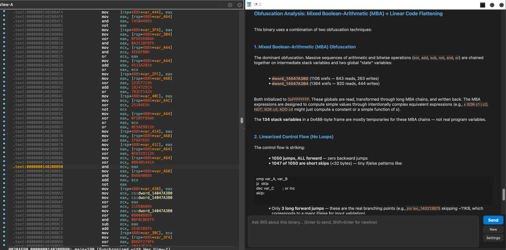

# Iris — The IDA Pro + Binary Ninja companion

A reverse-engineering plugin for **IDA Pro and Binary Ninja** that integrates a multi-provider LLM agent directly in your analysis UI. Iris provides an agentic loop with streaming, 57 host-native tools, 7 built-in analysis skills, MCP client support, and a native Qt chat panel.

This project was done together with my friend, Claude Code.


## Is this another MCP client?

No, Iris is an agent built to live inside your RE host (**IDA Pro or Binary Ninja**). It does not consume an MCP server to interact with the host database; it has its own agentic loop, context management, its own role prompt (you can check it [here](iris/agent/system_prompt.py)), and an in-process tool orchestration layer.

The agent loop is a generator-based turn cycle: each user message kicks off a stream→execute→repeat pipeline where the LLM response is streamed token-by-token, tool calls are intercepted and dispatched.

The results are fed back as the next turn's context. It supports automatic error recovery, mid-run user questions, plan mode for multi-step workflows, and message queuing, all without leaving the disassembler.

The agent really ***lives*** and ***breathes*** reversing.

Advantages:

- No need to switch to an external MCP client such as Claude Code
- Assistant first, not made to do your job (unless you ask it)
- Expandable to many LLM providers and local installations (Ollama)
- Quick enabling, just hit Ctrl+Shift+I and the chat will appear


Also, building agents is an amazing area of study, especially coding with them.


## Features

- **57 host-native tools** — navigation, decompiler, disassembly, xrefs, strings, annotations, type engineering, microcode/IL, scripting
- **7 built-in skills** — malware analysis, deobfuscation, vulnerability audit, driver analysis, CTF solving, and more
- **MCP client** — connect external MCP servers, their tools appear alongside built-in ones
- **9 quick actions** — context-menu/command integration for instant analysis
- **5 LLM providers** — Anthropic (Claude), OpenAI, Gemini, Ollama, OpenAI-compatible
- **Message queuing** — send follow-up messages while the agent is working; they auto-submit when the current turn finishes
- **Microcode/IL tools** — Hex-Rays microcode in IDA, native IL tools (LLIL/MLIL/HLIL) in Binary Ninja
- **Host-specific system prompts** — each host gets a tailored prompt with correct terminology
- **Session persistence** — auto-save/restore conversations across host restarts

## Requirements

- IDA Pro 9.0+ with Hex-Rays decompiler (recommended), or Binary Ninja (UI mode)
- Python 3.9+ (3.14 is known to have problems with Qt)
- At least one LLM provider


## Installation

Clone this repository, then run the installer for your target host:

**IDA Pro (Linux / macOS):**
```bash
./install.sh
```

**IDA Pro (Windows):**
```bat
install.bat
```

**Binary Ninja (Linux / macOS):**
```bash
./install_binaryninja.sh
```

**Binary Ninja (Windows):**
```bat
install_binaryninja.bat
```

All scripts auto-detect the user directory for their host. If detection fails (or you have a non-standard setup), pass the path explicitly:

```bash
./install.sh /path/to/ida/user/dir
install.bat "C:\Users\you\AppData\Roaming\Hex-Rays\IDA Pro"
./install_binaryninja.sh /path/to/binaryninja/user/dir
install_binaryninja.bat "C:\Users\you\AppData\Roaming\Binary Ninja"
```

Installers create plugin links/junctions, install dependencies, and initialize host-specific Iris config directories.

### Set your API key

Iris has a settings dialog to configure your model of choice. Open Iris → click Settings → paste your key.

- IDA config: `~/.idapro/iris/config.json`
- Binary Ninja config: `~/.binaryninja/iris/config.json` (or platform-equivalent user dir)


**Anthropic OAuth:** If you have Claude Code installed and authenticated, Iris auto-detects the OAuth token from the macOS Keychain. Otherwise, you can get the OAuth token by running `claude setup-token` (you'll have to log in again).


## Usage

### Open the panel

IDA Pro: press **Ctrl+Shift+I** or go to **Edit → Plugins → Iris**.  
Binary Ninja: use **Tools → IRIS → Open Panel**.


Type a message and press **Enter** to send. Iris streams the response and executes host tools as needed.

- **Enter** — send message
- **Shift+Enter** — newline
- **Escape** — cancel the current run (also clears queued messages)

### Message queuing

You can send messages while the agent is working. They appear as `[queued]` in the chat and auto-submit when the current turn finishes. Hit **Stop** to cancel the running turn and discard all queued messages.

### Quick actions

IDA Pro exposes these under right-click menus.  
Binary Ninja exposes equivalent commands under **Tools → IRIS** and address-context command menus.

| Action | Views | Behavior |
|--------|-------|----------|
| **Send to IRIS** | disasm, pseudo | Pre-fills input with selection (Ctrl+Shift+A) |
| **Explain this** | disasm, pseudo | Auto-explains the current function |
| **Rename with IRIS** | disasm, pseudo | Analyzes and renames with evidence |
| **Deobfuscate with IRIS** | disasm, pseudo | Systematic deobfuscation |
| **Find vulnerabilities** | disasm, pseudo | Security audit |
| **Suggest types** | disasm, pseudo | Infers types from usage patterns |
| **Annotate function** | pseudo | Adds comments to decompiled code |
| **Clean microcode / IL** | pseudo | Identifies and NOPs junk instructions |
| **Xref analysis** | disasm, pseudo | Deep cross-reference tracing |

### Skills

Skills are reusable analysis workflows. Type `/` in the input area to see available skills with autocomplete.

Create custom skills in:

- IDA: `~/.idapro/iris/skills/<slug>/SKILL.md`
- Binary Ninja: `~/.binaryninja/iris/skills/<slug>/SKILL.md`

Each skill lives in its own subdirectory.

```
~/.idapro/iris/skills/      # or ~/.binaryninja/iris/skills/
  my-skill/
    SKILL.md            # required — frontmatter + prompt body
    references/         # optional — .md files appended to the prompt
      api-notes.md
```

Skill format:
```markdown
---
name: My Custom Skill
description: What it does in one line
tags: [analysis, custom]
allowed_tools: [decompile_function, rename_function]
---
Task: <instruction for the agent>

## Approach
...
```

The `allowed_tools` field is optional — when set, the agent can only use those tools while the skill is active.

### MCP Servers

Connect external MCP servers to extend Iris with additional tools. Create the config file at:

- IDA: `~/.idapro/iris/mcp.json`
- Binary Ninja: `~/.binaryninja/iris/mcp.json`

```json
{
  "mcpServers": {
    "binary-ninja": {
      "command": "python",
      "args": ["-m", "binaryninja_mcp"],
      "env": {},
      "enabled": true
    }
  }
}
```

MCP servers are started when the plugin loads. Their tools appear alongside built-in ones with the prefix `mcp_<server>_<tool>` — the agent sees them in the tool list and can call them like any other tool. Set `"enabled": false` to keep a server configured without starting it.

## Tools

57 tools organized by category. IDA and Binary Ninja share the same interface; BN uses native IL terminology.

| Category | IDA Tools | BN Tools (where different) |
|----------|-----------|---------------------------|
| **Navigation** | `get_cursor_position`, `get_current_function`, `jump_to`, `get_name_at`, `get_address_of` | same |
| **Functions** | `list_functions`, `get_function_info`, `search_functions` | same |
| **Strings** | `list_strings`, `search_strings`, `get_string_at` | same |
| **Database** | `list_segments`, `list_imports`, `list_exports`, `get_binary_info`, `read_bytes` | same |
| **Disassembly** | `read_disassembly`, `read_function_disassembly`, `get_instruction_info` | same |
| **Decompiler** | `decompile_function`, `get_pseudocode`, `get_decompiler_variables` | same |
| **Xrefs** | `xrefs_to`, `xrefs_from`, `function_xrefs` | same |
| **Annotations** | `rename_function`, `rename_variable`, `set_comment`, `set_function_comment`, `rename_address`, `set_type` | same |
| **Types** | `create_struct`, `modify_struct`, `get_struct_info`, `list_structs`, `create_enum`, `modify_enum`, `get_enum_info`, `list_enums`, `create_typedef`, `apply_struct_to_address`, `apply_type_to_variable`, `set_function_prototype`, `import_c_header`, `suggest_struct_from_accesses`, `propagate_type`, `get_type_libraries`, `import_type_from_library` | same |
| **Microcode (IDA)** | `get_microcode`, `get_microcode_block`, `nop_microcode`, `install_microcode_optimizer`, `remove_microcode_optimizer`, `list_microcode_optimizers`, `redecompile_function` | — |
| **IL (BN)** | — | `get_il`, `get_il_block`, `nop_instructions`, `install_il_optimizer`, `remove_il_optimizer`, `list_il_optimizers`, `redecompile_function` |
| **Scripting** | `execute_python` (last resort — the agent prefers built-in tools) | same |

Binary Ninja uses native IL levels (`llil`, `mlil`, `hlil`) instead of IDA's MMAT maturity levels.


## Examples

Here's some practical and cool examples with Iris:

### Removing junk code 

### Solving CTF's

Testing against Flare-On's 2025 challeng 7: "[The Boss Needs Help](https://attachments-us-west-2.insided.com/7b772344-fabe-4978-9776-4a4b34d2ba67/7_%20The%20Boss%20Needs%20Help.pdf?Expires=1772357715&Signature=ilnXKZgpMaTBce5EfgI~OxlXNrsSAhHgtVaJU~ZAOfsmBzF5~O3Wkmgl6tRgQqeXlMhyMC3YSgAqdE33fS3azduoKngCnSq4-~fMOLb6A~BN6ReW8xomVaAmcj6GtnkSDlHpObjitsOObTAG2dZOm0bfCG2kkpaYm0LbcRulw5luXn7sOazQs~Q0uQ2o~AGTTwwqMQ6dTzWNMABkoAxbEzNEgtDLQYcWN7dRLSigh2dfA~IvtK9DXsfrPcBNmLN4Wbug8YTRb3R0SgFsDBGFo0GMDhF-bQbeNQqCjcBgG~LFPyigvnfs5nleYjE2WWpZxOtFrDFa~FLWB6-hMm6AwQ__&Key-Pair-Id=APKAJODP2KXSV47YM4AA)"



Chat:

```
User: This is a CTF challenge, all functions are too big to read, can you identify how the obfuscation works ? dont read everything, otherwise you'll run out of tokens
```

Iris:
```
...(picture above)


Only 3 long forward jumps — these are the real branching points (e.g., jnz loc_140213B75 skipping ~11KB, which corresponds to a major if/else for input validation)
Only 2 unconditional jumps (one is a 4-byte nop-skip)


The entire main function (109KB, 23,545 instructions) is completely linear — no loops, no backward edges. The program logic has been unrolled and flattened into a single straight-line sequence with the MBA chains acting as opaque computations between the small conditional blocks.


3. How the Real Logic Hides

The actual program logic is buried in:

35 call instructions — the real functionality (memory allocation, string comparison sub_140081590 at 336KB, I/O, etc.)
The short conditional jumps — these encode the actual comparisons/decisions but are drowned in MBA noise
Register constant loads (mov esi, 654213BBh; mov r12d, 0D9DA45AEh...) — 5 registers loaded with constants at branch points, likely encoding state for subsequent MBA chains

Want me to try to isolate the actual logic by filtering out the MBA noise, or focus on the string comparison function (sub_140081590)?
```

```
User: remove all the junk and clean the function, identify the pattern and remove it
```


### Batch renaming
